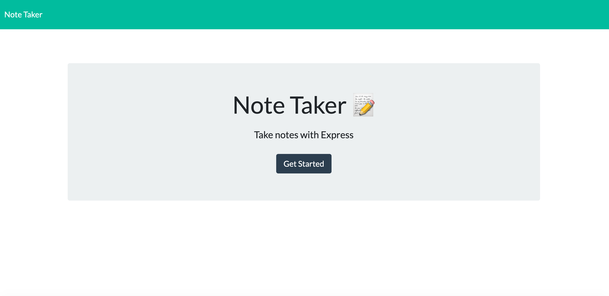

# NoteTaker

This assignment implemented a lot of new concepts that we had learned over the course of the week. We learned how to start our own server, utilize Express.js and Node.js to connect the front 
and back end environments. I also got practice with the GET and POST methods that are used within Express.js. Overall, this was definitely one of the most challenging homework assignments we have 
had to date. 

The objective of this assignment was to create a responsive app (deployed through Heroku) that would allow the user to take notes, view past notes, and delete desired notes. 
This makes me very excited that we are beginning to deploy projects, and I can't wait to see what I can learn next to make my apps more responsive. 

Here is a link to my deployed app: 
https://new-note-taker.herokuapp.com/

Here is a link to my respository: 
https://github.com/laurendoss/NoteTaker

And finally, here is a screenshot of the deployed app: 
